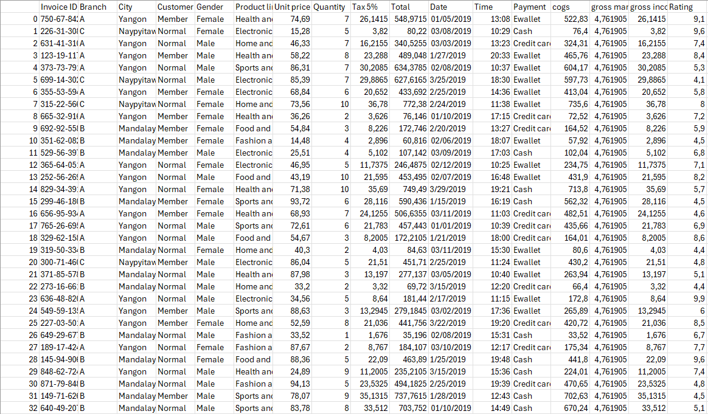
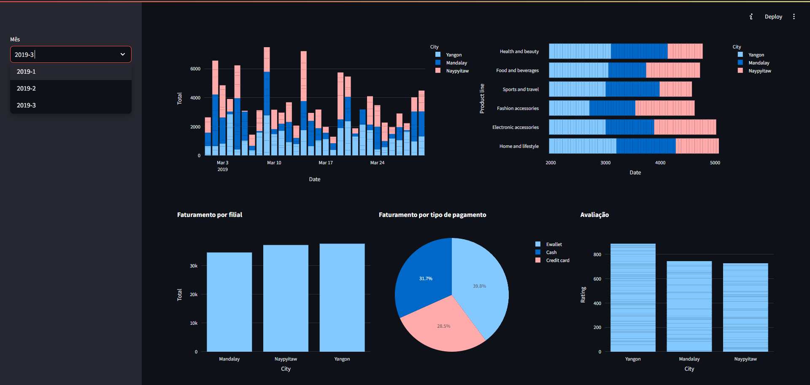

# Dashboard de Análise de Vendas de Supermercado em Python

Este projeto consiste em um dashboard interativo desenvolvido em Python utilizando as bibliotecas Streamlit e Plotly Express. O objetivo principal é analisar e visualizar os dados de vendas de um supermercado de maneira intuitiva e dinâmica.

## Funcionalidades Principais

- **Faturamento por Dia:** Gráfico de barras que mostra o faturamento diário por cidade.
- **Faturamento por Tipo de Produto:** Gráfico de barras horizontais que exibe o faturamento por tipo de produto ao longo do tempo.
- **Faturamento por Filial:** Visualização em barras que compara o faturamento entre as diferentes filiais do supermercado.
- **Distribuição de Pagamentos:** Gráfico de pizza que ilustra a distribuição do faturamento por método de pagamento.
- **Avaliação por Cidade:** Gráfico de barras verticais que apresenta a avaliação média das filiais por cidade.

## Dados Utilizados

Os dados utilizados neste projeto foram extraídos de um arquivo Excel contendo registros de vendas de supermercado. A análise e visualização são feitas em tempo real através do Streamlit, facilitando a interpretação e exploração dos dados.

## Dashboard

